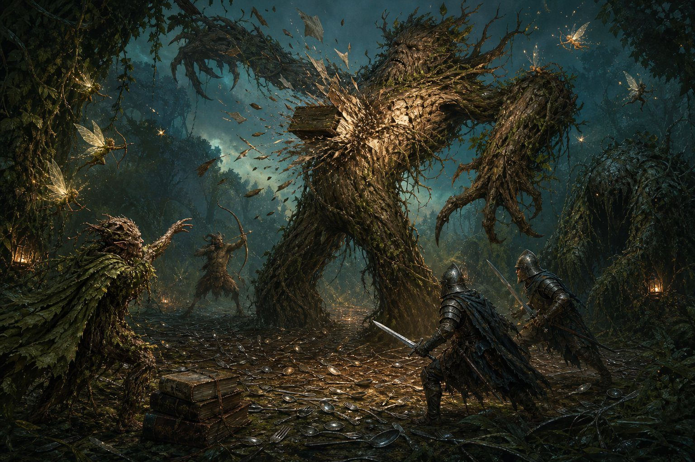

# How the Tree-Cutters Felled a Walking Forest: Woodfellow vs. the Treant

> **A battle article.** Compiled from the combat ledger of 17 August 2026
> (table time), filed under the **Feyward arc — the season the plants took
> over.** No session event has been filed for this engagement yet; every
> number below is quoted verbatim from the ledger in the appendix, and the
> prose invents nothing the dice did not say. No XP is recorded here — that
> belongs to the event filing, when it comes.
>
> **When:** Feyward-relative. Waluigi has stopped converting Feyward time and
> started respecting it.
> **Where:** the Feyward woodlands. No location id is registered for the
> cutting ground; this article declines to invent one.
> **Result:** expedition victory. The treant was destroyed at the lane; the
> shambling mound broke contact, was run down in the eighteen-minute gap the
> ledger does not narrate, and was destroyed. The sprite sorcerer routed.
> The field belongs to the cutters. **The cleanup is owed and will be filed
> separately.**

*The turning point, as the ledger tells it: a natural 20, fifty-five damage,
straight through the trunk.*

---

## Belligerents

| Side | On the field |
|---|---|
| **The expedition** (the tree-cutters) | **Woodfellow**; **Ramsee**; House Guards **Joseph** and **Renard**; the satyrs — swordfighter **"Swifty"**, the scout, the berserker, druid **Zach**; one Goblin Staff |
| **The wood that woke** | one **Treant** (AC 16, opened at 138) — *destroyed*; one **Shambling Mound** (110) — *broke contact, hunted down, destroyed*; two **Awakened Shrubs** — *destroyed* |
| **The sprites** (eleven of them) | Four warriors, three archers, three casters, one sorcerer. The ledger shows their arrows and their sleep-sand landing on *both* sides — and after the treant fell, on the *wood's* side too. This article treats the sprites as a weather condition; the weather changed sides. |
| **The Dryad** | Present. Initiative 21. The ledger records no action of hers. She watched, and when it ended, she was gone. |

Twenty-one drew initiative; twenty-four stood on the field once the mound and
the two shrubs walked in. By count, this is the largest engagement in the
Feyward record so far.

---

## Part I: The Wood Objected

The Feyward had been strangling itself for a season — vines that ate
memories, poison in the green, plants where plants should not be — and
somebody had finally hired a cutting crew to push a lane back through it.
The crew was satyrs and steel and one goblin with a kitchen knife, and at
its back walked two problem-solvers the forest should have thought harder
about: **Ramsee**, who throws cutlery, and **Woodfellow**, who throws books.

The wood's answer was orthodox. It woke up a treant.

*WAH! A treant is what a tree becomes after centuries of contemplation and
one bad day. The ledger gives it an armor class of 16 and one hundred
thirty-eight points of patience. It also — and I want this on the record —
rolled a 2 on initiative. The mightiest trees are not the fastest thinkers.
The encyclopedia has warned about this. Nobody reads the encyclopedia.*

## Part II: The Treant Opens

The treant's first lesson was delivered to Swifty, the satyr swordfighter,
with a branch the width of a door: a slam that the ledger scores at **18
against an armor class of 15, for 3d6+6 — twenty damage**. Swifty entered
that exchange with twenty-four hit points and left it with four, and the
ledger dutifully records that he *parried*. Whatever a parry is worth
against a tree, it is not eleven-sixteenths of a satyr.

Around them the scrum formed badly. House Guard Joseph fumbled his
longsword — a natural 1, recorded without comment by the ledger and with
lasting empathy by this author. The berserker's answer was cleaner: longsword
**18 against 17** into Renard for seven, and a ram that missed. The goblin's
knife found bark for three. Ramsee opened the cutlery account with a hit for
five and then, in the interest of narrative tension, did not hit anything
again for another twenty-nine minutes.

## Part III: The Sleep Wars

Then the sprites deployed the only tactic scarier than a treant: three
castings of *sleep*, one after another, into a fight with twenty-odd bodies
in a twenty-foot sphere.

The first dumped **5d8 = 19** points of unconsciousness into the melee and
took the weakest bodies first — sprites, mostly, which raises questions
about sprite logistics nobody stayed awake to answer. The second, **5d8 = 20**,
folded more of them; the ledger's strings go `21→0`, `2→0`, `21→1`, and it is
genuinely unclear whether some of those sprites ever woke up.

The third casting is the one that mattered, and it is the one that will be
cited at every subsequent safety meeting: **5d8 = 27**, thrown with the
treant still standing, and the sphere did not care whose side anyone was on.
Woodfellow dropped thirteen into sleep he did not ask for. A house guard
went **58→31** mid-sentence. An awakened shrub, technically on the wood's own
side, slept where it stood.

*WAH! I have filed entire essays on area effects and the herds' relationship
with the concept of "friendly." The concept remains theoretical. The 27 is
not.*

## Part IV: Arrows With Opinions

The middle of the battle is where the Feyward earned its reputation, because
the arrows stopped agreeing with the people firing them.

The satyr scout — a professional, with a longbow — put two shots at the
treant's ally and instead hit **Swifty**: the first a miss, the second a
*natural 20*, **2d8+3 = 18 damage** into his own side's swordfighter, the
same satyr who had four hit points left after the treant's opening slam.
The ledger's next string is `4→0`. The friendly arrow finished him; whether
the healers reached him before the whistle is the cleanup's story, not
this one's. The ledger does not explain the shots, because the ledger
cannot. Later the same scout rolled a natural 1 at the treant. Whatever
the wood wanted from that bow, it did not want consistency.

Druid Zach, meanwhile, was fighting the battle three times at once:
*thunderwave* for **9** into the sprites, *thunderwave* for **12** into the
treant, *shillelagh* on his own staff with a shamrock leaf he had to keep
re-casting, and a concentration check every time somebody objected. The
sprites objected — one of their arrows put him down six against a poison
save of ten. He kept casting. The ledger shows the concentration rolls
stacking up like a man being interrupted mid-sentence and finishing the
sentence anyway.

House Guard Renard's line in the ledger reads like a weather report from
somewhere with weather: seven from the berserker, nine from a longbow, seven
more from a sprite arrow whose poison he saved against by exactly ten, five
from a scimitar the size of a dessert spoon — and at the end of the day he
stood at **six hit points** and was one of the healthy ones.

## Part V: The Library Opens

The treant had twice tried to end Woodfellow personally — a slam for
**fifteen** that connected, a second at 14 against 16 that the ledger
politely rounds to "no" — and in doing so it made the only mistake the
Feyward could not forgive: it identified the librarian.

Woodfellow had already deleted the wood's reinforcements. When the two
awakened shrubs walked in, he threw one tome into the first — **4d10+6 =
30 damage against a creature that had ten hit points**, an overkill the
ledger records with a straight face — and a second book, **18 damage**, at
the other. The wood's bench was cleared by artillery.

Then the book that ended the battle. A natural 20. **8d10+6 — fifty-five
damage**, straight through the trunk. The ledger's strings show the treant
at sixty before it landed and thirty-three after, and I have done the
arithmetic four times because I did not believe it either. One follow-up
tome, **22 more**, and the string that closes the account: `6→0`.

The mightiest tree in the record fell over into the lane the crew had cut,
which is the sort of ending this encyclopedia usually has to invent.

## Part VI: The Hunt

When the treant came down, the ledger says the mound reassessed — morale
BOLD, per its own line, which makes what followed possible and what came
next inevitable. It broke contact. Then the ledger goes **silent for
eighteen minutes**, from 5:29 to 5:47, and what happened in that silence is
the difference between *withdrew* and *was destroyed*: they hunted it. No
rolls survive the pursuit. Only its end does.

The record resumes mid-kill. The mound — one hundred ten hit points of
vegetable grudge, per the ledger's own strings — is being taken apart by
everything the lane has left. Ramsee's cutlery finally connects again,
**fifteen against fifteen, for seven**, redeeming twenty-nine minutes of
aerodynamics. The books arrive next: Woodfellow's tome for **twenty-eight**,
a natural 1 fumble that this article respectfully declines to dramatize,
then **seventeen** and **twenty-one** together, then, at the end, **eighteen**
with a **twenty-seven** delivered into what was already a corpse — the
ledger records both, because the ledger has no sentiment.

And in the middle of the execution, the weather changed sides. A sprite
archer — the wood's own weather — put an arrow into the mound for five and
poisoned it, its saving throw an **8 against 10**, and did it again minutes
later, the second save a **1**. The sorcerer's morale broke first — the
ledger's word is **ROUT** — and somewhere in the same minute a sprite caster
put a *faerie firebolt* for **fourteen** into a sprite archer. Whatever
contract the Feyward had with itself, the treant's death voided it.

The expedition paid for the pursuit. A sprite warrior put Renard down —
**25 against 17, for eight**, his string ends `4→0` — the second guardsman
of the Swifty Line, carried or dragged, fate deferred to the cleanup.

The last strings in the ledger belong to the mound: `18→0`, then a final
`-27` into the zeros, which is not damage so much as punctuation.

The dryad left during the gap, or near it; no action of hers is recorded
before or after, and this article declines to speculate about what a
non-combatant knew and when she knew it.

The field belonged to the cutters. The field was also, at that moment, a
disaster area — which is the next filing, not this one.

*WAH! I have watched a lot of ordnance in my career. For twenty-nine
minutes the fork was ceremonial. Then the mound met the fork, the book, the
weather, and the weather's own firebolt, in that order, and I am filing the
whole sequence under "victory conditions, coalition."*

---

## Aftermath

- **Treant: destroyed.** 138 at first blood, 0 at the last string, felled by
  two tomes, one of them a natural 20 for 55.
- **Shambling mound: hunted down and destroyed.** 110 hit points, run to
  ground in the eighteen-minute silence, taken apart by cutlery, five tomes,
  and two poisoned arrows fired by the wood's own weather. The ledger's last
  hostile string is a `-27` into the zeros.
- **Awakened shrubs: both destroyed**, by single tomes, overkill ×3 and ×1.8.
- **The sprites: broken.** The sorcerer's morale string reads **ROUT (12)**;
  the archers read SHAKEN; several never woke from the sleep wars; at least
  one was firebolted by its own side. The wood's contract with itself
  voided on the treant's death.
- **The expedition: standing — barely.** One house guard at 31 after the
  third sleep, Woodfellow at 114 and visibly annoyed — and two in the
  ledger's zeros: **Swifty at 0** (his own side's critical arrow) and
  **Renard at 0** (a sprite scimitar during the hunt), both fates deferred
  to the cleanup filing.
- **The cleanup** — wounded, prisoners, salvage, what you do with a fallen
  treant and a murdered mound in a lane you just cut — is recorded in the
  follow-up filing (*pending*, will be added to the index).

---

## Waluigi's assessment

I was not there. I have read the ledger twice and the arrow patterns a third
time, and here is what the numbers say that the narrators will not:

The expedition did not win because it was stronger. It won because the wood
fought itself harder than it fought the cutters — three sleep spells thrown
into its own melee, a scout's crit into his own swordfighter, shrubs put
down by friendly tomes' splash, and at the end its own weather poisoning the
dying mound and firebolting its own archers. All the expedition had to do
was stay standing, and the one of them with the *books* stayed standing
best. The pursuit was not mercy and it was not strategy. It was arithmetic:
the mound had one hundred ten hit points and the librarian had books left.

There is a lesson here and it is the same lesson as always, and it is filed
under my name, and nobody thanked me for it: **know what your ordnance hits.
The sphere does not check uniforms.** WAH.

---

## Appendix: From the combat record

Verbatim from the ledger of 17 Aug 2026 (times table-side). Every number
quoted in the prose above appears here.

| Time | Line | Result |
|---|---|---|
| 5:15 | Initiative (21 combatants) | Sprite Warrior 23 · Dryad 21 · Swifty 21 · Scout 21 · HG 20 · **Treant 5** · Ramsee 5 |
| 5:16 | Treant Slam → Swifty | 1d20+6+4 = **18** vs AC 15 · 3d6+6 = **20** (Swifty 24→4, Parry logged) |
| 5:16 | HG Joseph Longsword → Treant | natural **FUMBLE** (1+3+2 = 6) |
| 5:17 | Sprite Caster *Sleep* #1 | **5d8 = 19** |
| 5:17 | Satyr Druid *Thunderwave* | **2d8 = 9** |
| 5:18 | Sprite Archer → Zach | hit · 1d4+4 = 6 · poison save 4+2 = **6 vs DC 10 (fail)** |
| 5:18 | Ramsee Cutlery → Treant | 15+3+2 = 20 · 1d4+3 = **5** (his only hit) |
| 5:19 | Shambling Mound joins | initiative 15 |
| 5:20 | Scout Longbow → Swifty | 4+3+2 = 9 (miss) · then **CRIT nat 20** = 25 · 2d8+3 = **18** (Swifty `4→0`) |
| 5:20 | Shrubs join | 2 × Awakened Shrub, initiative 15 |
| 5:21 | Woodfellow Hurl Tome → Shrub #1 | 4+6+4 = 14 vs AC 9 · 4d10+6 = **30** (10→0) |
| 5:21 | Woodfellow Hurl Tome → Shrub #2 | 17+6+4 = 27 · 4d10+6 = **18** → 0 |
| 5:22 | Sprite Archer → Treant | **CRIT nat 20** = 26 · 2d4+4 = 8 · Con save 14 |
| 5:23 | Sprite Caster *Sleep* #2 | **5d8 = 20** (strings include 21→0, 2→0, 21→1) |
| 5:23 | Zach *Thunderwave* → Treant | **2d8 = 12** |
| 5:24 | Treant Slam → Woodfellow | 14+6+4 = 24 vs AC 16 · 3d6+6 = **15** |
| 5:24 | Scout Longbow → Renard | 13+3+2 = 18 vs 17 · 1d8+3 = 9 |
| 5:25 | Zach *Thunderwave* → Woodfellow | **2d8 = 13** |
| 5:26 | Treant Slam → Woodfellow | 4+6+4 = 14 vs 16 — **miss** |
| 5:26 | Sprite Warrior → Renard | 17+4+2 = 23 vs 17 · 1d4+4 = 5 |
| 5:27 | **Woodfellow Hurl Tome → Treant** | **CRIT nat 20** = 30 vs AC 16 · **8d10+6 = 55** (60→33) |
| 5:28 | Sprite Caster *Sleep* #3 | **5d8 = 27** (Woodfellow 127→114 · HG 58→31 · shrub 33→20) |
| 5:29 | Scout Longbow → Treant | natural **FUMBLE** (1+3+2 = 6) |
| 5:29 | HG Longsword ×2 → Treant | 18 = hit, 11 · 20 = hit, 11 |
| 5:29 | **Woodfellow Hurl Tome → Treant** | 19+6+4 = 29 · 4d10+6 = **22** — ledger closes the treant: `6→0` |
| 5:29–5:47 | **the gap** | no rolls recorded — the pursuit of the mound happened here |
| 5:47 | Ramsee Cutlery → Mound | 10+3+2 = **15 vs 15** · 1d4+3 = **7** (mound `110→103`) |
| 5:48 | Sprite Warrior → Renard | 19+4+2 = **25 vs 17** · 1d4+4 = **8** (Renard `4→0`) |
| 5:49 | Woodfellow Tome → Mound ×2 | 24 vs 15 · 4d10+6 = **28** (`103→75`) · then **FUMBLE** nat 1 |
| 5:49 | Morale | Sprite Sorcerer: **ROUT (12)** · Sprite Archer: SHAKEN (39) |
| 5:49 | Sprite Archer → Mound | 17 vs 15 · 5 dmg · poison save **8 vs 10 (fail)** |
| 5:49 | Ramsee Cutlery → Mound | 20 vs 15 · 1d4+3 = **4** |
| 5:50 | Woodfellow Tome → Mound ×2 | 26 vs 15 · **17** · 27 vs 15 · **21** (`66→49→28`) |
| 5:51 | Sprite Archer → Mound | 22 vs 15 · 5 dmg · poison save **1 vs 10 (fail)** |
| 5:51 | Sprite Caster *Faerie Firebolt* → Sprite Archer | 19 vs 15 · 4d6 = **14** — the wood fires on itself |
| 5:51 | Ramsee Cutlery → Mound | 16 vs 15 · 1d4+3 = **5** |
| 5:52 | **Woodfellow Tome → Mound ×2** | 18 dmg (`18→0`) · then **27 into the zeros** — the mound is destroyed |

*Ledger bookkeeping entries (hit-point strings, resource refunds) belong to
the table, not to the world, and are excluded per rule zero.*
