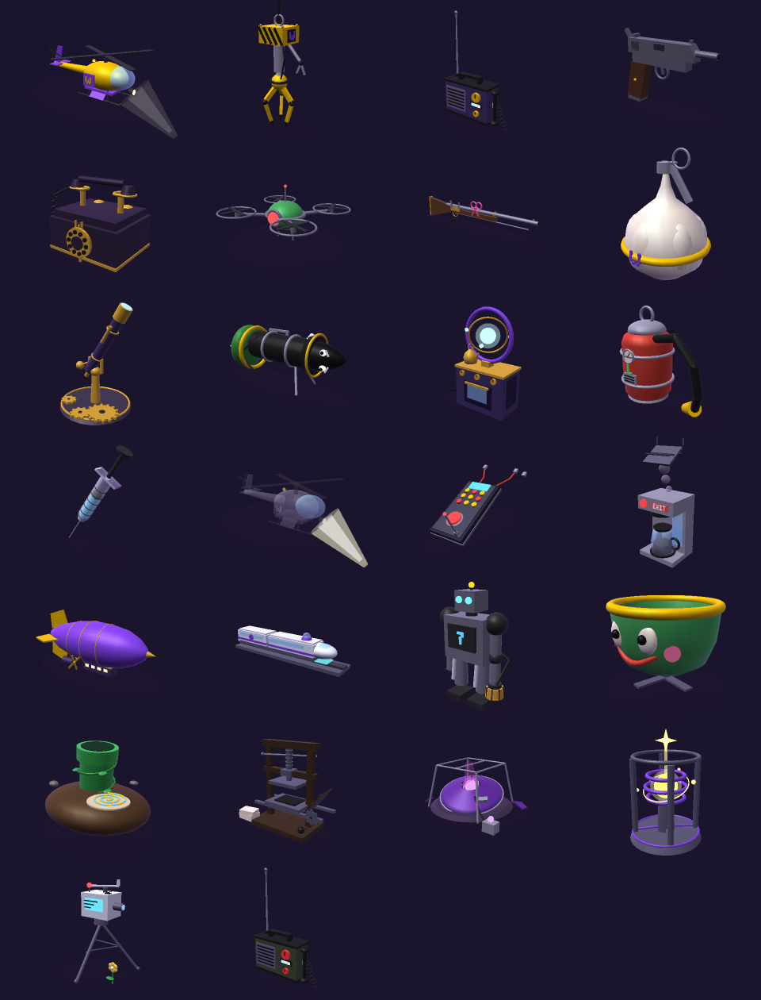

# Discovered Technology — the ledger, the 3D models, and the tension board

**Route:** `#/technology` (also `#/tech`, and the old sub-app's `#/research`).
**Data:** `Reputation-Matrix2/data/technology.json`.
**Code:** `assets/technology/technology.js` (views + tension arithmetic),
`assets/technology/tech-models.js` (3D recipes), `assets/technology/technology.css`.
**Checks:** `python3 tools/check-technology.py` (in `check-all`),
`node tools/tests/test-technology-page.mjs`, `node tools/tests/test-tech-gl.mjs`
(the renderer and every model, rendered), and the live boot
`node tools/tests/technology-live-smoke.mjs` (needs `python3 -m http.server 8765`).
To *look* at the models: `node tools/render-tech-models.mjs` → `/tmp/techpng/sheet.png`.

---

## What it replaced, and why

The site had a technology section once. It lived in the old sub-app at
`Reputation-Matrix2/app/pages/research/` and it was a **procedural tech tree**:
thirteen nations, six categories, fifty invented nodes per category
(`research-names.js`, 3,378 lines of generated names), progress read straight
off the calendar (`DAYS_PER_TIER = 600`), and a seven-phase "global cycle"
(Calm → Discovery → Expansion → Tension → Conflict → Crisis → Rebirth) nudged
by regex matches on rumour titles. That cycle is the **country-tension system**
the archive half-remembers. It had a wheel with Tension at the top, and it was
the only place the site tried to say *how strained the world is*.

None of it could be traced to an article. No node named a filing; the wheel
turned because a rumour title contained the word "siege". When the main site
was rebuilt around `index.html`, the section was left behind — no route, no
sidebar link, nothing in search. Readers of the Rot-Zone filing could not ask
the archive "what was that pistol, and where else has one turned up?"

This system answers that question with a **ledger** instead of a tree, and it
keeps the one good idea the old page had — the cycle vocabulary — by deriving
it from the ledger instead of from rumour titles.

---

## The ledger

Every entry is a piece of technology a filing actually describes. The shape:

```json
{
  "id": "tech_paulos_courier_pistol",
  "name": "A Courier's Cheap Pistol",
  "kind": "weapon",                  // meta.kinds: weapon siege vehicle communications device construct magitek medical infrastructure
  "tier": "industrial",              // meta.tiers: dawn iron discovery industrial cosmic
  "icon": "🔫",
  "territory": {
    "nation": "mushroom_kingdom",    // nations.json id, or null
    "region": null,                  // meta.regions key for named contested ground (eastern_midlands), or omit
    "plane": "material",             // material | shadow | fey | mirror | disputed
    "location": "dr_toads_star_hill_clinic",   // locations.json id, or null
    "label": "Star Hill - the clinic's main street and the storehouse stairwell"
  },
  "origin": { "faction": null, "maker": "Unknown - cheap, and it jams", "holder": "paulo" },
  "firstSeen": {
    "event": "the_rot_zone_at_star_hill",
    "date": "2 Aethel, 1035 BF",
    "year": 1035,
    "timeCode": "TC:1035-09-02/MAT",   // optional; must equal the article's own timeCode
    "confidence": "filed"              // filed | estimated | unverified
  },
  "sightings": [ { "event": "...", "year": 1035, "note": "..." } ],
  "status": "With Paulo - jammed twice on the record ...",
  "summary": "One sentence.",
  "record": "Two to five sentences in the archive's voice: what the filing shows the thing doing.",
  "quotes": [ { "event": "the_rot_zone_at_star_hill", "text": "The pistol clicked." } ],
  "pressure": 2,                      // -3 .. +3, see below
  "tension": [ { "between": ["wario_enterprise", "mushroom_regency"], "weight": 1, "why": "..." } ],
  "model": { "recipe": "pistol", "palette": { "metal": "#5b5b66", "grip": "#4a2f1e", "accent": "#e0b400" } },
  "tags": ["rot-zone", "star hill", "paulo", "sidearm"]
}
```

### The rules the check enforces

| Rule | Why |
|---|---|
| **Quotes are verbatim.** `check-technology.py` normalises markdown, links, curly quotes and whitespace on both sides and then demands the words appear in the source article. | The ledger is a reading of the filings, not a second canon. A quote the article does not contain is an invention. |
| **`firstSeen.year` must be a year on the source article's date** unless `confidence` is `estimated` or `unverified`. | The year is what the tension board sorts on. "Approximately Highsun 22, 955 BF" is `955`, confidence `estimated`. |
| **Territory ids resolve.** Nation in `nations.json`, location in `locations.json`, region in `meta.regions`. | A territory the atlas cannot find is a territory the board cannot show. |
| **Faction keys resolve** (`factions.json` ∪ `factionColors.json`); holders resolve in `characters.json`. | Strain between two factions nobody has filed is noise. |
| **`pressure` is an integer in [−3, 3]; tension weights 1..3 with a `why`.** | Keeps the arithmetic legible: a reader can recompute a territory by hand. |
| **`model.recipe` exists in `tech-models.js`.** | The viewer must have something to build. |
| **At least one quote per entry.** | No quote, no entry. |

### What counts as technology

A machine, weapon, instrument, vehicle, line, or device that a filing shows
**doing something** — or that a character describes with enough specificity
that the archive would be lying to leave it out (the kitchen portal device at
Raventree is on the ledger as `unverified` for exactly that reason). The
Legion's airlift that never came is on the ledger too: a piece of technology
that exists in the Legion's sentences and nowhere else on the record is a fact
about the Legion.

Not technology: magic that is only magic (Ice Storm), paperwork (file it as a
prop), terrain, animals.

### Pressure — the one authored number

`pressure` is the filer's reading of what the filing shows the thing **doing
to the ground it stands on**:

| Value | Reads as | Examples |
|---|---|---|
| **+3** | Arms the territory outright | Siege machinery against a residence; artillery carried onto contested ground; a device that could close every portal |
| **+2** | A weapon used, or a war asset positioned | A pistol fired in a clinic street; a military airship at a border keep; a transport flown into a crash |
| **+1** | Armed presence, surveillance, or a promise with force behind it | A musket given as a gift; a drone in a castle; an airlift promised and not delivered |
| **0** | Neutral | A telephone, a coffee machine, a syringe used as issued |
| **−1** | Settles or connects | A printing press; a warp pipe; a telescope; a maglev line |
| **−2 / −3** | Reserved for things that end a conflict on the record | (none filed yet) |

Pick it from the quotes. If you cannot point at the sentence that justifies
the number, lower it.

---

## The tension board (`#/technology/tension[/<year>]`)

Nothing on the board is authored. For a chosen year **Y** (default: the archive
clock, `currentDate.json`):

```
weight(appearance)   = 1.0  same year     0.7  one year back
                       0.4  within 5 yrs  0.15 older or undated
                       0    not yet filed (year > Y)

contribution(entry)  = Σ over dated appearances (firstSeen + sightings)
                         pressure × weight
                       capped at ±1.5 × |pressure|        -- seen four times ≠ four things

territory score      = Σ contribution(entry) for entries on that ground
```

A **territory** is the nation id when the entry names one, else the named
region (`region:eastern_midlands`), else the plane (`plane:shadow`). The
Shadowfell's strain is the Shadowfell's.

The score is **banded with the old wheel's vocabulary** so a reader of the
original research page recognises the readings:

| Band | Score | Reads as |
|---|---|---|
| Cycle of Calm | ≤ −1.5 | Tools and medicine outnumber weapons on the record |
| Cycle of Discovery | ≤ 1 | New things on the record and nobody shooting yet |
| Cycle of Tension | ≤ 3 | Arms are on the ground and the filings say who is pointing them |
| Cycle of Conflict | ≤ 6 | Weapons have been used in the territory this cycle |
| Cycle of Crisis | above | Siege machinery, artillery or planar hardware in play |
| Cycle of Rebirth | derived | Score fell by ≥ 3 since the previous filing year and sits ≤ 1 |

(The old wheel's *Expansion* phase had no honest source in a ledger of things
and is not used.)

**Faction strain** is the second output: each entry's `tension[]` edges are
summed across the ledger with the same recency weight, giving "who is strained
with whom" — every pair lists the entries and the `why` lines behind it.

Every number on the board links to the entry, and every entry links to the
filing. That is the whole improvement over the old system: **it can be argued
with.** If the Kingdom reads Crisis in 1035 BF, the page shows you the claw,
the helicopter and the pistol, and the three articles they came from.

### Reading the current board

As of the archive clock (1040 BF): the contested Eastern Midlands reads
Conflict (Bowser's Bullet Bill cannon, the Raventree portal device), the
Mushroom Kingdom reads Conflict (the Debt Siege arc at five years' distance),
the Regal Empire and the Shadowfell read Tension. Switch the strip to 1035 BF
and the Kingdom reads Crisis on the night of the Debt Siege. Switch to 955 BF
and the Kingdom sits below zero: a printing press and a maglev line, no guns
yet.

---

## The 3D models



Every entry names a **recipe** in `assets/technology/tech-models.js`, and the
recipe is a real model of the thing the article describes — the helicopter
has the W on its doors and the searchlight that found the archivist, the claw
has its hazard stripes and the W plate, the Bullet Bill is halfway out of the
cannon, the garlic grenade is a bulb with the pull-ring on top, the coffee
machine wears the EXIT sign. They are low-poly and read at a glance; the entry
page still says *a model read off the filing, not a photograph*.

**There is no library and no network.** `assets/technology/tech-gl.js` is a
self-contained renderer (~550 lines, classic script, `window.TECH_GL`) that
draws the same part list two ways with the same maths:

| Path | When | What it does |
|---|---|---|
| **WebGL 1** | any browser with a canvas context | antialiased, per-pixel lit, premultiplied alpha over the panel's gradient; ~24 fps idle auto-rotate, pointer drag, pinch / ctrl-wheel zoom, double-click reset |
| **software rasteriser** | WebGL refused (locked-down browser, `file://` on some engines, software-only machines) | the identical scene rasterised into a 2D canvas at ≤300 px wide, throttled to ~24 fps; the help line says *software renderer* |
| **icon fallback** | no canvas at all (jsdom) | the entry's icon and a one-line note; the ledger still reads |

The earlier Three.js-from-jsDelivr build was replaced because the sandbox
(and any offline reader) could never load it, so the models could never be
*seen* — and nothing that cannot be looked at can be checked. The software
path is also what node uses: `tools/render-tech-models.mjs` renders every
entry to PNG, and `tools/tests/test-tech-gl.mjs` renders them all again and
measures the result.

### Recipes

A recipe is a function `(P) => parts[]` where `P` is the entry's palette.
Helpers in `tech-models.js` build the parts:

| Helper | Makes |
|---|---|
| `box(w,h,d,p,c,x)` `cyl(rTop,rBot,h,p,c,x)` `cone(r,h,p,c,x)` `sph(r,p,c,x)` `tor(R,tube,p,c,x)` | primitives at position `p` (`[x,y,z]`), colour `c` (palette key or `#hex`), extras `x` |
| `lathe(points,p,c,x)` | surface of revolution around Y (`[[radius,height],…]`, either direction) — bulbs, bells, bowls |
| `prism(points,depth,p,c,x)` | convex outline in XY extruded along Z (either winding) — blades, fins, hammers |
| `bar2 / bar3(a,b,r,c,x)` | a strut from point `a` to point `b` (explicit matrix; `r2` for a taper, `caps:false` for an open cone) |
| `tube(points,r,c,x)` | polyline of bars with ball joints — hoses, cords, smiles |
| `helix(c,R,h,turns,n)` | points for a coiled cord |
| `gear(R,teeth,th,c,x)` `star4(size,th,p,c,x)` `letters(text,cell,p,c,x)` | cog, four-point star, 5×5 block letters (E X I T 7 R P O W A N G L D U S M C Y 1 -) |
| `grp(p,r,parts,x)` | a group: position / rotation / scale / `spin` / `bob` apply to the children |

Extras (`x`) on any part: `r:[rx,ry,rz]` Euler rotation (applied X·Y·Z),
`sc` scale, `e:0..1` emissive, `metal:0..1`, `a` alpha,
`spin:'y'|{axis,speed,phase}`, `bob:{amp,speed}`, `nb:true` (leave out of
the bounds — light beams), `ghost:true` (34 % alpha, used for the Legion's
promised airlift). Each recipe may set `T.name.view = {yaw,pitch}` for its
opening angle.

Orientation facts that keep coming up: `rotZ(−π/2)` turns a Y-up cylinder
into a barrel pointing **+x**; `rotX(π/2)` lays a torus flat; the camera's
default view looks from **+x +z**, so put the face of the thing on that side.

```js
T.my_thing = (P)=>[
  box(1.0, 0.4, 0.6, [0, 0.2, 0], 'body'),                         // w,h,d, position, palette key
  cyl(0.05, 0.05, 1.2, [0, 0.9, 0], 'mast'),                       // rTop,rBottom,h
  grp([0,1.5,0], null, [ box(2.0,0.04,0.12,[0,0,0],'blade'), box(0.12,0.04,2.0,[0,0,0],'blade') ], {spin:{axis:'y',speed:9}}),
  sph(0.1, [0.4, 0.3, 0.3], 'lamp', {e:1}),
  letters('W', 0.04, [0.51, 0.25, 0], 'mark', {r:[0,PI/2,0]}),     // faces +x
];
T.my_thing.view = {yaw:0.5, pitch:0.3};
```

Then look at it — `node tools/render-tech-models.mjs --only my_thing --views`
writes four angles to `/tmp/techpng/`. Palette keys are whatever the entry's
`model.palette` supplies; unknown keys fall back to grey. `tools/check-technology.py`
parses recipe names with `^\s*T\.(name)\s*=` so the recipe must be declared
on its own line. Keep a model under ~8 000 triangles (`test-tech-gl.mjs`
enforces it; the render tool prints the count).

### What the renderer test proves (`tools/tests/test-tech-gl.mjs`)

Primitives are watertight and wound the way their normals point (a lathe
profile listed either way and a prism outline wound either way come out
facing outward); the column-major matrices map axes as documented; all 26
entries build, stay inside the triangle budget, render centred with a sane
share of the frame, and change by under 1.5 % of pixels when back faces are
culled (consistent winding everywhere); `mount()` returns `null` without a
canvas, runs the software path on a 2D context, throttles, auto-rotates,
tears down on `destroy()` and when its host leaves the DOM; and a recording
WebGL stand-in shows the GL path sets every uniform the shaders declare with
typed arguments and frees every buffer on dispose.

---

## Where it shows up

| Surface | What |
|---|---|
| Sidebar → World → **🔬 Discovered Technology** | count of entries |
| `#/technology` | the ledger: hero with a turning featured model, "where the pressure is", kind / era / territory filters, a tile per entry |
| `#/technology/<id>` | entry page: model viewer, the record, the verbatim quotes with source links, sightings, pressure and strain, nearby entries |
| `#/technology/tension[/<year>]` | the board, with a year strip for every year on record |
| `#/technology/territory/<key>` | one territory: every driver as a table (pressure × weight = contribution, source filing), the by-year strip, the entries |
| Event pages → *The file behind this record* → **🔬 Technology** tab | the entries first seen or seen again on that filing |
| Research Bureau (search) | kind `Technology`, routed to the entry page |
| Home → updates rail | the `kind:"route"` SITE_UPDATES card |

---

## Filing a new piece of technology (the step in the session pipeline)

After the event is written (Step 5) and the exhibits are filed (Step 6):

1. Read the event prose for machines, weapons, instruments, vehicles, lines.
   For each: is it **doing something** on the record, or described with
   specificity? If neither, skip it.
2. Is it already on the ledger? Search `technology.json` by name and tag. If
   yes, add a **sighting** `{event, year, note}` and, if the status changed
   (wrecked, confiscated, handed over), update `status`.
3. If new: copy the nearest entry, fill every field, pick the nearest recipe,
   write one to three **verbatim** quotes from the event text, choose
   `pressure` from the table above, add `tension[]` edges only between faction
   keys that exist, and tag it with the arc name.
4. `python3 tools/check-technology.py` — fix every line it prints.
5. `node tools/tests/test-technology-page.mjs` and, if you touched a recipe,
   `node tools/tests/test-tech-gl.mjs` plus a look at the render.
6. Mention the entries in the run report under cross-system updates.

The Rot-Zone filing's own pass added: `tech_paulos_courier_pistol` (new),
`tech_wario_transport_helicopter` (sighting: wrecked on the storehouse roof),
`tech_enterprise_field_radio` (sighting: the informant's "private wing" line).

---

## Decisions

- **Ledger, not tree.** A tree of invented nodes cannot be checked; a ledger of
  quoted sightings can. The check refuses what the archive cannot back.
- **Derived tension.** The one authored number is per-entry `pressure`, chosen
  from quotes. Everything above it is arithmetic shown on the page.
- **Old vocabulary kept.** Calm / Discovery / Tension / Conflict / Crisis /
  Rebirth are the old wheel's words, so the continuity is honest; *Expansion*
  is dropped because nothing on a ledger of things can source it.
- **Region buckets for contested ground.** Raventree is not the Kingdom and
  not the Empire; `meta.regions.eastern_midlands` gives it its own row rather
  than lumping it into "the material plane".
- **Own renderer, no CDN.** The first cut lazy-loaded Three.js from jsDelivr
  like Chart.js; it was dropped because a reader (or this sandbox) without
  that CDN never saw a model, and models nobody can see cannot be checked.
  `tech-gl.js` is small, has a software path for browsers without WebGL, and
  renders in node so the recipes are tested as pictures, not as promises.
- **Script-scope globals.** `index.html` declares `esc`, `el`, `Router`, `DATA`
  and `CUR` with top-level `const`/`let`, which puts them in the global
  *script scope*, not on `window`. `technology.js` reaches them by name through
  an indirect `eval` and falls back to a stub `window` in tests. Don't "fix"
  this by reading `window.esc` — it is undefined in the real page.
- **The old research page stays where it is.** Nothing in
  `Reputation-Matrix2/app/pages/research/` was deleted; it is an unrouted
  prototype now, listed in `docs/ARCHITECTURE_AUDIT.md` as superseded.
